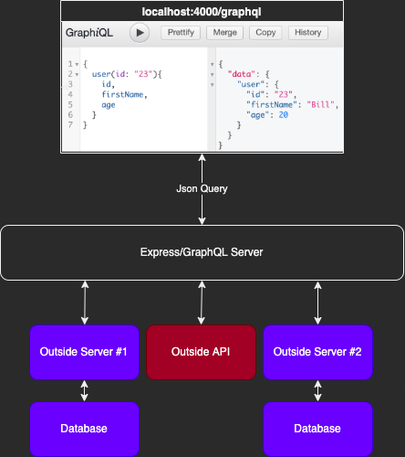

# Table of Contents
* [Summary](#summary)
    * [Packages](#packages)
    * [Directory Structure](#directory-structure)
    * [How to Use](#how-to-use)
        * [Local](#local)
        * [Building the Docker Container](#building-the-docker-continer)
        * [Running the Docker Container](#running-the-docker-container)

# Summary
This directory is for practicing GraphQL in isolation (no database, use the `users` variable in `/schema/schema.js`). Uses the `GraphiQL` interface for the front-end.

<p align="center">

</p>

To view in a browser, go to: `localhost:4000/graphql`

50% of the effort in GraphQL is writing your `schema.js`. The other 50% is writing `queries` for your `schema.js`.

## Packages
* `json-server`

## How to Use
This implementation uses the `json-server` package to provide the `db.json` file, which will serve as a mock API The `json-server` package is about building very small, very fast fake API's to serve data.

If you haven't installed `json-server` yet, do so with this command (also make sure you install the packages listed in the top-level `README.md` if you haven't):
* `npm install --save json-server`

Note that the JSON Server is a separate decoupled entity from the GraphQL Server. To that effect, an additional line has been added to the `package.json` file to call the `json-server`:

Modification to: **package.json**
```
...
"scripts": {
  "test": "echo \"Error: no test specified\" && exit 1",
  "json:server": "json-server --watch db.json"
},
...
```

<p align="center">

</p>
Unlike `graphql_practice_no_database`, this project uses `async` (`promises`) to retrieve information from `json-server`.
1. GraphiQL front-end makes HTTP request to GraphQL `express` server.
2. GraphQL makes a HTTP request of`json-server`, for example for `user=23`.
3. The `json-server` responds with `user=23`.
4. GraphQL waits for the request to resolve, and get the user back.
5. GraphQL sends the user in a `response` to the GraphiQL front-end.

### Local
First, `cd` into the directory this `README.md` is located in.

If you haven't already, modify `db.json` with your particular data structure. For example (don't forget that valid JSON requires double quotes `" "`):
```
{
    "users": [
        { "id": "23", "firstName": "Bill", "age": 20 },
        { "id": "40", "firstName": "Alex", "age": 40 }
    ]
}
```

Start the JSON Server in `Terminal 2`:
* `npm run json:server`
* Note: We can use this command because we added the `json-server` line in `package.json` as described above in the [How to Use](#how-to-use) section.

While the `json-server` is running, go to `localhost:3000`. For the `json.db` that comes with this directory, you can also go to `localhost:3000/users` to view the data example or `localhost:3000/users/23` to see a specific user.

Start the `express` server in `Terminal 1`:
* `node server.js`

While the `express` server is running, go to `localhost:4000/graphql`.

If you make changes to `schema.js`, restart the `express` server.

### Building the Docker Container
First, `cd` into the directory this `README.md` is located in.

Run the following command:
* `docker build -t graphql_practice_json_server .`

### Running the Docker Container
Start the container:
* `docker run -p4000:4000 graphql_practice_json_server`

Then go to `localhost:4000/graphql` in your browser.