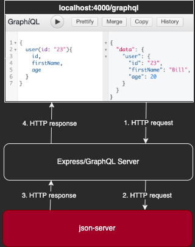
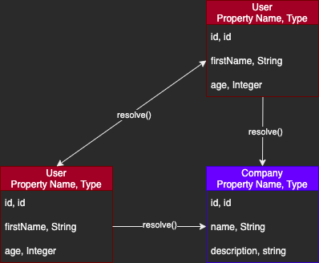
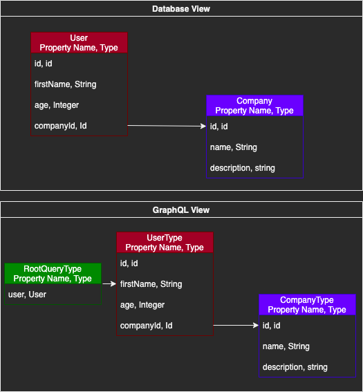

# Table of Contents
* [Summary](#summary)
    * [Important Files](#important-files)
    * [Packages](#packages)
    * [Directory Structure](#directory-structure)
    * [How to Use](#how-to-use)
        * [Local](#local)
        * [Building the Docker Container](#building-the-docker-continer)
        * [Running the Docker Container](#running-the-docker-container)
* [More about JSON Server](#more-about-json-server)
* [The Resolve Function](#the-resolve-function)
* [Database View versus GraphQL View](#database-view-versus-graphql-view)
* [Bidirectional Relationships](#bidirectional-relationships)
    * [Common Gotcha of this kind of Relationship](#common-gotchas-of-this-kind-of-relationship)

# Summary
This directory is for practicing GraphQL with a JSON Server (`json-server` package). This is a backend-focused practice project.
If you are just getting started with GraphQL, it's better to start with `graphql_practice_no_database` and learn `queries`.
Once you are done with `queries`, you can then use this project to practice `mutations` (editing the backend using GraphQL) as well
as some very basic backend verification with the `GraphQLNonNull()` wrapper.

Some `json-server` specific notes are contained in this `README.md`, but many relevant (generalized) notes are contained in the 
`README.md` at the top directory.

For this project, `axios` is a promise-based HTTP client used to make all of our REST calls (`post`, `get`, `patch`, etc) and supports `node.js`.

## Important Files
1. `json.db`: This is where your data should be stored/modified.
2. `schema.js`: This is where you establish your GraphQL `schema`.
3. `server.js`: This is where you control the `express` server for GraphQL.
4. `package.json`: This is where you add additional helper commands, in this project's case the `json:server` component to start the `json-server`.

## Packages
* [`json-server`](https://github.com/typicode/json-server)
* [`axios`](https://github.com/axios/axios)

## How to Use
This implementation uses the `json-server` package to provide the `db.json` file, which will serve as a mock API The `json-server` package is about building very small, very fast fake API's to serve data.

If you haven't installed `json-server` or `axios` yet, `cd` to the `graphql_practice_json_server` directory and do so with these commands (also make sure you install the packages listed in the top-level `README.md` if you haven't):
* `npm install --save json-server`
* `npm install --save axios`

Note that the JSON Server is a separate decoupled entity from the GraphQL Server. To that effect, an additional line has been added to the `package.json` file to call the `json-server`:

Modification to: **package.json**
```
...
"scripts": {
  "test": "echo \"Error: no test specified\" && exit 1",
  "json:server": "json-server --watch db.json"
},
...
```

Also note that in `schema.js` the `resolve()` function is what is used to fetch data, and since we're using `axios` in that function it's important to double check that the return value is in a form that GraphQL expects. In this case, `axios` returns a `{data: {firstName: 'bill'}}` which is NOT the correct shape. See the `schema.js` to see how this is handled.

<p align="center">

</p>
Unlike `graphql_practice_no_database`, this project uses `async` (`promises`) to retrieve information from `json-server`:

1. GraphiQL front-end makes HTTP request to GraphQL `express` server.
2. GraphQL makes a HTTP request of`json-server`, for example for `user=23`.
3. The `json-server` responds with `user=23`.
4. GraphQL waits for the request to resolve, and get the user back.
5. GraphQL sends the user in a `response` to the GraphiQL front-end.

### Local
First, `cd` into the directory this `README.md` is located in.

If you haven't already, modify `db.json` with your particular data structure. For example (don't forget that valid JSON requires double quotes `" "`):
```
{
    "users": [
        { "id": "23", "firstName": "Bill", "age": 20 },
        { "id": "40", "firstName": "Alex", "age": 40 }
    ]
}
```

Start the JSON Server in `Terminal 2`:
* `npm run json:server`
* Note: We can use this command because we added the `json-server` line in `package.json` as described above in the [How to Use](#how-to-use) section.

While the `json-server` is running, go to `localhost:3000`. For the `json.db` that comes with this directory, you can also go to `localhost:3000/users` to view the data example or `localhost:3000/users/23` to see a specific user.

Start the `express` server in `Terminal 1`:
* `node server.js`

While the `express` server is running, go to `localhost:4000/graphql`.

If you make changes to `schema.js`, restart the `express` server.

### Building the Docker Container
First, `cd` into the directory this `README.md` is located in.

Run the following command:
* `docker build -t graphql_practice_json_server .`

### Running the Docker Container
Start the container:
* `docker run -p4000:4000 -p3000:3000 graphql_practice_json_server`

Then go to `localhost:4000/graphql` in your browser.

You can also visit the `json-server` at `localhost:3000`.

# More About JSON Server
An excellent tool for setting up Mock data/backend for when you need to do middle/frontend development.
* [GitHub: json-server](https://github.com/typicode/json-server)
* [Create a REST API With JSON Server](https://medium.com/codingthesmartway-com-blog/create-a-rest-api-with-json-server-36da8680136d)

# The Resolve Function
The `resolve()` function ties different 'nodes' in the graph of GraphQL together. In other words, a `UserType` (Node) can hold a reference to a `CompanyType` (Node) and the `resolve()` function acts as a path (Edge). Each of the edges of the graph are `resolve()` functions.

<p align="center">

</p>

# Database View versus GraphQL View
GraphQL treats the data like it's a graph. 

<p align="center">

</p>

# Bidirectional Reference
Commonly, we'll want to be able to do something like be able to ask a `User` what their company is while also asking a `Company` who their (List) of `User`s are. This kind of bidirectional reference requires a `resolve()` function inside each type that points to the other. In the case of `User` it's straightforward; point to a single `Company` by id. However when asking a `Company`, we'll need to return a `GraphQLList` of users.

## Common Gotcha of this kind of Relationship
It's important to keep in mind that Bidirectional reference creates a Circular reference (`UserType` depends on `CompanyType`, but `CompanyType` also depends on `UserType`), which will often result in errors. For example if `CompanyType` is defined first, then:
```
ReferenceError: UserType is not defined.
```

To fix this, find the `fields` object and wrap it with an Arrow Function. The Arrow function allows us to define the entire file first before attempting to execute. In other words, this is a JavaScript closure scope issue (not a GraphQL issue).
```
fields: () => ({ ... })
```

For example:
```
const CompanyType = new GraphQLObjectType({
    name: 'Company',
    fields: () => ({ // This modification here: fields: () => ({ ... })
        id: { type: GraphQLString },
        name: { type: GraphQLString },
        description: { type: GraphQLString },
        users: {
            type: new GraphQLList(UserType),
            resolve(parentValue, args) {
                return axios.get(`http://localhost:3000/companies/${parentValue.id}/users`)
                    .then(res => res.data);
            }
        }
    })
});
```