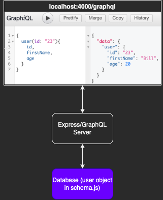

# Table of Contents
* [Summary](#summary)
    * [Important Files](#important-files)
    * [Packages](#packages)
    * [Directory Structure](#directory-structure)
    * [How to Use](#how-to-use)
        * [Local](#local)
        * [Building the Docker Container](#building-the-docker-continer)
        * [Running the Docker Container](#running-the-docker-container)

# Summary
This directory is for practicing GraphQL in isolation (no database, use the `users` variable in `/schema/schema.js`). Uses the `GraphiQL` interface for the front-end.

## Important Files
1. `schema.js`: This is where you establish your GraphQL `schema`. For this project directory, it's also where your data is stored (see the `users` variable in the script).
2. `server.js`: This is where you control the `express` server for GraphQL.

## Packages
No additonal packages necessary (beyond the ones specified in the top-level `README.md`).

## How to Use
To practice GraphQL in isolation, this project makes use of a minimal `express` server (`server.js`) and replaces a call to a database with hardcoded data held within the script itself (the `user` variable inside `schema.js`).

The workflow is as follows:
1. Construct your `graphql` `schema.js`. Includes the following:
  * Configure 'mock database' object `users`
  * Configure your data 'types', mapping them to GraphQL types i.e.: `UserType = new GraphQLObjectType`
  * Configure your `root query` i.e.: `RootQuery = new GraphQLObjectType`
2. Start/Docker Build & Run the `express` server (see below)

### Local
First, `cd` into the directory this `README.md` is located in.

Start `express` server:
* `node server.js`

While the `express` server is running, go to `localhost:4000/graphql`.

If you make changes to `schema.js`, restart the `express` server.

### Building the Docker Container
First, `cd` into the directory this `README.md` is located in.

Run the following command:
* `docker build -t graphql_practice_no_database .`

### Running the Docker Container
Start the container:
* `docker run -p4000:4000 graphql_practice_no_database`

Then go to `localhost:4000/graphql` in your browser.